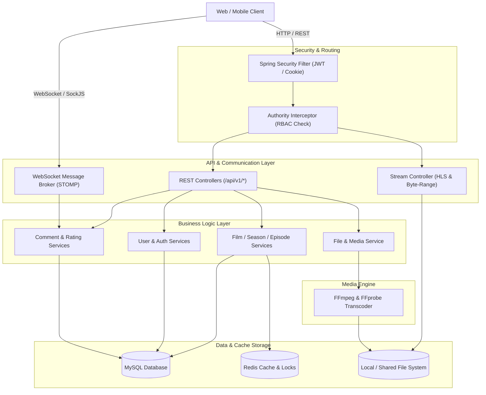

# 🎬 AniHoyo - Backend Server

<p align="center">
  
  
  
  
  
  
  
  
</p>

---

## 📌 Giới thiệu tổng quan

**AniHoyo Backend Server** là hệ thống RESTful API & Media Streaming chuyên biệt dành cho nền tảng xem phim anime trực tuyến. Dự án được xây dựng trên nền tảng **Spring Boot 3 (Java 17)** kết hợp giải pháp xử lý và phân phối video thích ứng (**HLS - HTTP Live Streaming**) thông qua **FFmpeg**, cơ chế lưu cache & chống gian lận lượt xem bằng **Redis**, xác thực bảo mật chuẩn **OAuth2/JWT**, phân quyền động **RBAC**, và tương tác thời gian thực thông qua **WebSocket (STOMP)**.

---

## 🚀 Tính năng nổi bật

### 1. 🎞️ Video Streaming & Adaptive Bitrate (HLS)
- **Tự động Transcode Video**: Sử dụng `FFmpeg` và `FFprobe` để kiểm tra độ phân giải gốc của video và sinh ra các luồng phát thích ứng (**360p, 720p, 1080p,...**).
- **Phân đoạn HLS (`.m3u8` & `.ts`)**: Chia video thành các segment 10 giây kèm theo `master.m3u8` và các playlist con theo chất lượng, tối ưu băng thông và trải nghiệm người xem.
- **HTTP Range Byte Streaming**: Hỗ trợ streaming video truyền thống thông qua header `Range: bytes=...` (hỗ trợ tua nhanh, seek mượt mà).

### 2. 🔐 Bảo mật & Phân quyền động (Dynamic RBAC)
- **Spring Security 6 & OAuth2 Resource Server**:
  - Mã hóa mật khẩu bằng `BCryptPasswordEncoder`.
  - Cơ chế **Access Token** (JWT) gắn trong header và **Refresh Token** tự động cấp mới, lưu trữ an toàn trong **HttpOnly Cookie**.
- **Dynamic Authority Interceptor**:
  - Phân quyền động theo cặp `(API Path, HTTP Method)`.
  - Quản trị viên có thể linh hoạt cấp/hủy quyền của các vai trò (`Role` - `Permission`) trực tiếp từ cơ sở dữ liệu mà không cần sửa code hoặc deploy lại server.

### 3. ⚡ Redis Caching & Chống gian lận lượt xem (View Spam Protection)
- **Hiệu năng cao với Cache**: Tự động lưu cache các danh sách phim hot, top 5 anime xem nhiều nhất, các mùa phim liên quan (`@Cacheable`, `@CacheEvict`).
- **Chống spam lượt xem**: Ứng dụng lệnh nguyên tử `SETNX` với thời gian sống (TTL) 24h trên Redis theo `sessionId` của từng client, ngăn chặn việc gian lận số lượt xem (View Count) của phim.

### 4. 💬 Tương tác thời gian thực (Real-time WebSocket)
- Tích hợp **WebSocket (STOMP + SockJS)**:
  - Bình luận trực tiếp (`/topic/comments/{seasonId}`) theo từng bộ phim/mùa phim theo thời gian thực.
  - Thả tim / like bình luận realtime (`/topic/comments/like`).
- Hệ thống thông báo người dùng (Notifications) linh hoạt.

### 5. 📑 Quản lý dữ liệu phong phú & Lọc động
- Quản lý phân cấp: **Phim (Film) ➔ Mùa phim (Season) ➔ Tập phim (Episode)**.
- Quản lý Thể loại (Category), Nhãn (Tag), Đánh giá số sao (Rating 1-5 sao).
- **Spring Filter (`com.turkraft.springfilter`)**: Cho phép client tìm kiếm và lọc dữ liệu đa điều kiện phức tạp thông qua cú pháp URL query linh hoạt.

### 6. 📖 Tích hợp OpenAPI 3 / Swagger
- Toàn bộ API được tài liệu hóa với giao diện Swagger UI, dễ dàng tích hợp và kiểm thử.

---

## 🏛️ Kiến trúc hệ thống



---

## 📂 Cấu trúc thư mục dự án

```text
AniHoyo-backend-server/
├── .mvn/                              # Maven wrapper configuration
├── src/
│   ├── main/
│   │   ├── java/com/HieuPahm/AniHoyo/
│   │   │   ├── AniHoyoApplication.java # Main Application Entrypoint
│   │   │   ├── config/                # Cấu hình Spring (Security, JWT, WebSocket, Redis, OpenAPI, CORS, RBAC)
│   │   │   │   ├── AuthorityIntercepter.java
│   │   │   │   ├── DatabaseInitializer.java # Tạo dữ liệu Admin & Quyền mặc định
│   │   │   │   ├── SecurityConfiguration.java
│   │   │   │   ├── WebSocketConfig.java
│   │   │   │   └── ...
│   │   │   ├── controller/            # REST API & WebSocket Controllers
│   │   │   │   ├── AuthController.java
│   │   │   │   ├── FilmController.java
│   │   │   │   ├── SeasonController.java
│   │   │   │   ├── EpisodeController.java
│   │   │   │   ├── StreamController.java   # Phục vụ HLS (.m3u8, .ts) & byte-range
│   │   │   │   ├── CommentController.java
│   │   │   │   └── ...
│   │   │   ├── domain/                # Chuẩn hóa RestResponse<T>
│   │   │   ├── model/
│   │   │   │   ├── dtos/              # Data Transfer Objects (Req/Res)
│   │   │   │   └── entities/          # JPA Entities (Film, Season, Episode, User, Role, v.v.)
│   │   │   ├── repository/            # Spring Data JPA Repositories
│   │   │   ├── services/              # Service Interfaces & Implementations
│   │   │   │   └── implement/
│   │   │   └── utils/                 # Exception handlers, constants, Security utilities
│   │   └── resources/
│   │       ├── application.yml        # Cấu hình chung (Port, multipart limit, JWT validity)
│   │       ├── application-dev.yml    # Cấu hình môi trường phát triển (Local DB, Redis)
│   │       └── application-prod.yml   # Cấu hình môi trường triển khai (Biến môi trường)
├── Dockerfile                         # Dockerfile Multi-stage (tích hợp FFmpeg)
├── pom.xml                            # Quản lý thư viện Maven
└── README.md                          # Tài liệu dự án
```

---

## 🛠️ Yêu cầu môi trường (Prerequisites)

Trước khi chạy ứng dụng, hãy đảm bảo máy tính/server của bạn đã cài đặt:

- **Java Development Kit (JDK)**: Phiên bản **17** trở lên.
- **Maven**: Phiên bản 3.8+ (hoặc dùng sẵn `./mvnw`).
- **MySQL**: Phiên bản 8.0 trở lên.
- **Redis Server**: Phiên bản 6.x / 7.x trở lên.
- **FFmpeg & FFprobe**: Đã cài đặt và thêm vào đường dẫn hệ thống (`PATH`), hoặc chỉ định đường dẫn tuyệt đối trong file cấu hình.

---

## ⚙️ Cấu hình môi trường

Tạo cơ sở dữ liệu trong MySQL:
```sql
CREATE DATABASE anihoyo CHARACTER SET utf8mb4 COLLATE utf8mb4_unicode_ci;
```

### Các thông số cấu hình (`application-dev.yml` / `application-prod.yml`):

| Thuộc tính / Biến môi trường | Mô tả | Giá trị mặc định (Dev) |
|---|---|---|
| `server.port` / `SERVER_PORT` | Cổng dịch vụ Backend | `8083` |
| `spring.datasource.url` / `DB_HOST` | Địa chỉ kết nối MySQL | `jdbc:mysql://localhost:3306/anihoyo` |
| `spring.datasource.username` / `DB_USERNAME` | Tài khoản MySQL | `root` |
| `spring.datasource.password` / `DB_PASSWORD` | Mật khẩu MySQL | Cấu hình theo máy của bạn |
| `spring.data.redis.host` / `REDIS_HOST` | Địa chỉ Redis Server | `localhost` |
| `spring.data.redis.port` / `REDIS_PORT` | Cổng Redis | `6379` (hoặc `6377` ở dev) |
| `anihoyo.jwt.base64-secret` / `JWT_SECRET` | Khóa bí mật ký JWT (Base64) | Chuỗi khóa bí mật |
| `hieupham.upload-file.base-uri` | Thư mục lưu trữ media/video upload | `file:///D:/Side-project/AniHoyo-RestfulService/storage/` |
| `hieupham.ffmpeg-path` | Đường dẫn file thực thi `ffmpeg` | `C:\ffmpeg\bin\ffmpeg.exe` hoặc `/usr/bin/ffmpeg` |

---

## 🚀 Hướng dẫn khởi chạy

### Cách 1: Chạy trực tiếp qua Maven Wrapper

1. **Clone repository**:
   ```bash
   git clone https://github.com/HieuPahm-R2/AniHoyo-backend-server.git
   cd AniHoyo-backend-server
   ```

2. **Chỉnh sửa file cấu hình**:
   Cập nhật thông tin kết nối MySQL, Redis và đường dẫn FFmpeg trong `src/main/resources/application-dev.yml`.

3. **Chạy ứng dụng**:
   - Trên **Windows**:
     ```powershell
     .\mvnw.cmd spring-boot:run
     ```
   - Trên **Linux/macOS**:
     ```bash
     chmod +x mvnw
     ./mvnw spring-boot:run
     ```

4. **Kiểm tra trạng thái**:
   - Truy cập Swagger API Documentation: [http://localhost:8083/swagger-ui/index.html](http://localhost:8083/swagger-ui/index.html)
   - Endpoint kiểm tra CORS / Health: `GET http://localhost:8083/api/v1/test-cors`

---

### Cách 2: Triển khai bằng Docker

Dự án đã có sẵn `Dockerfile` multi-stage, tự động cài đặt `ffmpeg` trên nền OpenJDK 17:

1. **Build Docker image**:
   ```bash
   docker build -t anihoyo-backend:latest .
   ```

2. **Khởi chạy container**:
   ```bash
   docker run -d \
     --name anihoyo-backend \
     -p 8083:8083 \
     -e DB_HOST=host.docker.internal \
     -e DB_USERNAME=root \
     -e DB_PASSWORD=your_mysql_password \
     -e REDIS_HOST=host.docker.internal \
     -e REDIS_PORT=6379 \
     -e JWT_SECRET=qoAEABDke07+AVLepXB4aCMtsT0wMAqR5x2VFyldsnx6e75YQkJH2UcZKTjEyoNgG71SBCXfq5N6NVZxWOfsHQ== \
     -v /your/storage/path:/uploads \
     anihoyo-backend:latest
   ```

---

## 👤 Dữ liệu khởi tạo & Tài khoản mặc định

Khi khởi động lần đầu với cơ sở dữ liệu trống, `DatabaseInitializer` sẽ tự động tạo danh sách toàn bộ Permissions, gán vào Role `ADMIN` và tạo tài khoản quản trị viên:

- **Email**: `admin@gmail.com`
- **Mật khẩu**: `123456`
- **Vai trò**: `ADMIN` (Đầy đủ toàn quyền thao tác trên hệ thống)

---

## 📚 Danh mục API chính (API Reference)

Tất cả các API RESTful được tiền tố bởi: `/api/v1`

### 1. Xác thực (Authentication)
| Method | Endpoint | Mô tả | Yêu cầu quyền |
|---|---|---|---|
| `POST` | `/api/v1/auth/login` | Đăng nhập hệ thống (trả về JWT & set HttpOnly cookie) | Public |
| `POST` | `/api/v1/auth/register` | Đăng ký tài khoản người dùng mới | Public |
| `GET` | `/api/v1/auth/account` | Lấy thông tin tài khoản người dùng hiện tại | Đã đăng nhập |
| `GET` | `/api/v1/auth/refresh` | Cấp mới Access Token bằng Refresh Token từ Cookie | Public |
| `POST` | `/api/v1/auth/logout` | Đăng xuất, vô hiệu hóa token và xóa Cookie | Đã đăng nhập |

### 2. Phim & Mùa phim (Films & Seasons)
| Method | Endpoint | Mô tả |
|---|---|---|
| `GET` | `/api/v1/films` | Lấy danh sách phim (hỗ trợ phân trang, lọc bằng Spring Filter) |
| `GET` | `/api/v1/film/{id}` | Lấy thông tin chi tiết phim theo ID |
| `POST` | `/api/v1/add-film` | Thêm mới phim (Admin) |
| `PUT` | `/api/v1/update-film` | Cập nhật thông tin phim |
| `DELETE` | `/api/v1/delete-film/{id}` | Xóa phim |
| `GET` | `/api/v1/seasons` | Lấy danh sách mùa phim (phân trang) |
| `GET` | `/api/v1/seasons/by-film/{filmId}` | Lấy danh sách season thuộc một phim |
| `GET` | `/api/v1/seasons/top-views` | Lấy top 5 anime có lượt xem cao nhất (Cached) |
| `GET` | `/api/v1/seasons/related/{seasonId}`| Lấy các season liên quan (Cached) |
| `POST` | `/api/v1/{id}/view?sessionId=...` | Tăng lượt xem cho season (chống spam với Redis) |

### 3. Tập phim & Truyền phát Video (Episodes & Streaming)
| Method | Endpoint | Mô tả |
|---|---|---|
| `GET` | `/api/v1/episodes/by-season/{seasonId}` | Lấy danh sách các tập phim thuộc season |
| `POST` | `/api/v1/add-episode` | Tạo mới tập phim |
| `POST` | `/api/v1/upload/video` | Tải lên file video gốc |
| `GET` | `/api/v1/stream/range/{id}` | Stream video dạng Byte-Range (`Accept-Ranges: bytes`) |
| `GET` | `/api/v1/{id}/master.m3u8` | Tệp chỉ mục phát HLS chính (Master Playlist) |
| `GET` | `/api/v1/{id}/{quality}/index.m3u8` | Playlist HLS theo độ phân giải (360p, 720p, 1080p) |
| `GET` | `/api/v1/{id}/{quality}/{segment}.ts` | File phân đoạn video HLS (`.ts`) |

### 4. Bình luận & Tương tác (Comments & Ratings)
| Method | Endpoint | Mô tả |
|---|---|---|
| `GET` | `/api/v1/comments/{ssId}` | Lấy danh sách bình luận theo season |
| `POST` | `/api/v1/comments/post/{ssId}` | Đăng bình luận mới qua REST |
| `POST` | `/api/v1/comments/{ssId}/{parentId}/reply` | Trả lời bình luận |
| `POST` | `/api/v1/comments/{commentId}/like` | Thả tim / Bỏ like bình luận |
| `POST` | `/api/v1/ratings` | Đánh giá sao (1 - 5) |
| `GET` | `/api/v1/ratings/average/{seasonId}` | Lấy điểm đánh giá trung bình |

---

## 📡 Giao thức WebSocket (STOMP Protocol)

- **WebSocket Connection URL**: `ws://localhost:8083/ws` (hoặc `http://localhost:8083/ws` với SockJS).
- **Application Destination Prefix**: `/app`
- **Broker Prefix**: `/topic`

### Danh sách kênh tương tác:
1. **Đăng bình luận trực tiếp**:
   - Gửi tin tới: `/app/comment.post`
   - Lắng nghe sự kiện tại: `/topic/comments/{seasonId}`
2. **Thả tim bình luận trực tiếp**:
   - Gửi tin tới: `/app/comment.like`
   - Lắng nghe sự kiện tại: `/topic/comments/like`

---

## 📦 Định dạng phản hồi chuẩn (Response Format)

Toàn bộ API trả về cấu trúc JSON thống nhất thông qua lớp `RestResponse<T>`:

```json
{
  "statusCode": 200,
  "error": null,
  "message": "Call API success",
  "data": {
    "id": 1,
    "name": "Sword Art Online"
  }
}
```

Đối với các API có phân trang (`PaginationResultDTO`):
```json
{
  "statusCode": 200,
  "error": null,
  "message": "Fetch all data films",
  "data": {
    "meta": {
      "page": 1,
      "pageSize": 10,
      "pages": 5,
      "total": 48
    },
    "result": [ ... ]
  }
}
```

---

## 👨‍💻 Tác giả & Đóng góp

- **Tác giả**: **Hieu Pham** ([@HieuPahm-R2](https://github.com/HieuPahm-R2))
- **Dự án Frontend liên quan**: `AniHoyo-frontend-src` (ReactJS, TypeScript, Vite, Video.js HLS)

Mọi đóng góp, báo lỗi (issues) hoặc yêu cầu tính năng (pull requests) đều rất được hoan nghênh! Hãy mở issue trên GitHub để cùng trao đổi.
